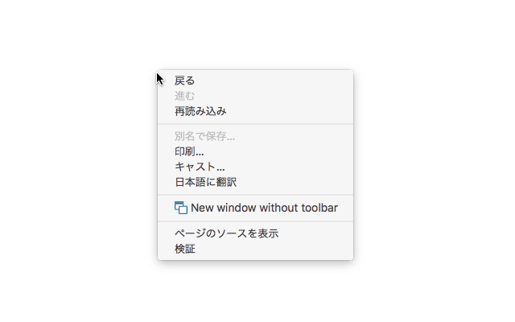
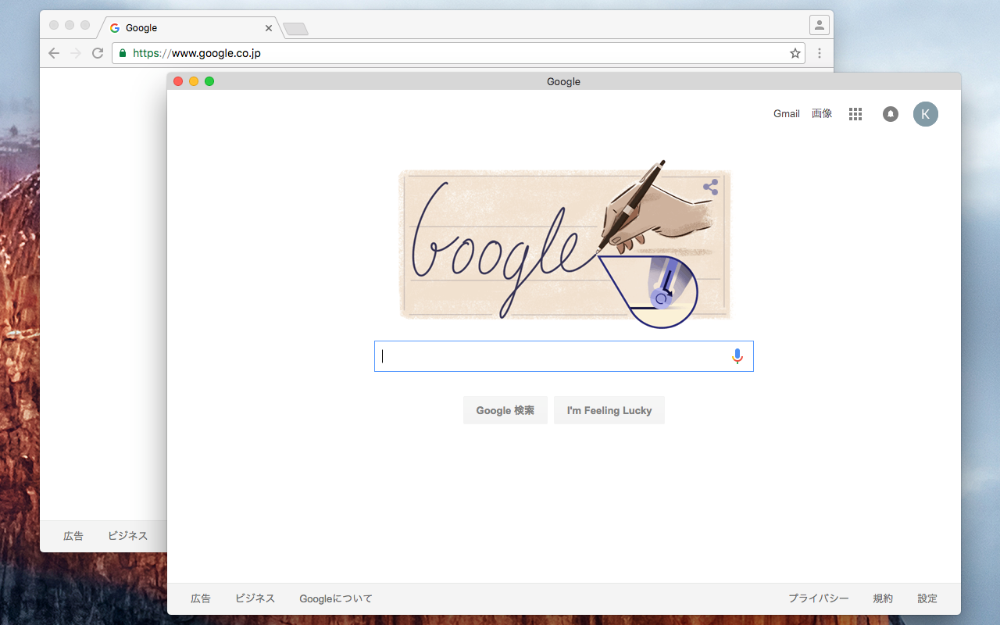
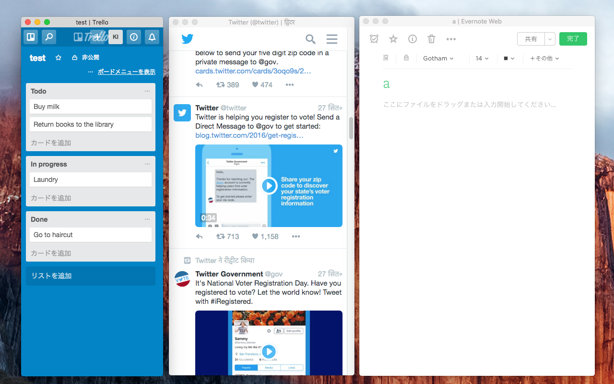

# NewWindowWithoutToolbar

Open current page in new window without toolbar.

* [New window without toolbar - Chrome Web Store](https://chrome.google.com/webstore/detail/new-window-without-toolba/epcobhhlenfbjlmooebphgjcgdmbjgnb)
* [New window without toolbar - Firefox Add-ons](https://addons.mozilla.org/ja/firefox/addon/new-window-without-toolbar/)

This WebExtension uses [EmailThis/extension-boilerplate (MIT Licence)](https://github.com/EmailThis/extension-boilerplate).
